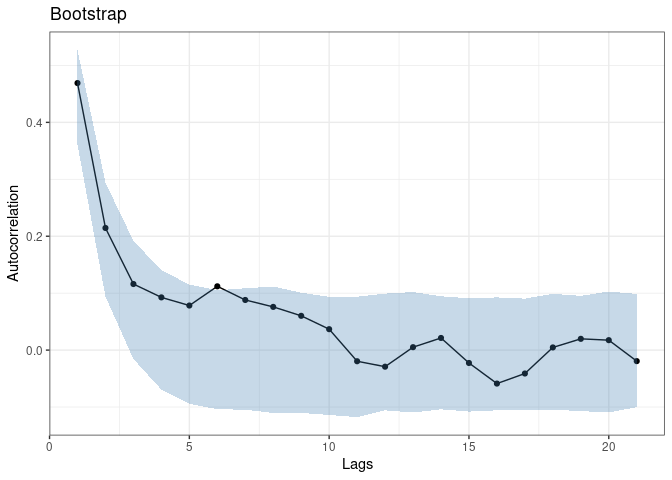
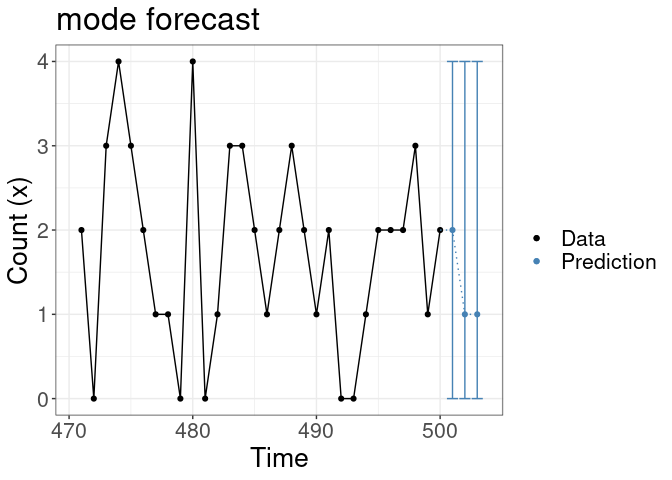

<!-- README.md is generated from README.Rmd. Please edit that file -->

# coconots

<!-- badges: start -->
[](https://github.com/manuhuth/coconots/actions/workflows/R-CMD-check.yaml)
[](https://app.codecov.io/gh/manuhuth/coconots?branch=main)
<!-- badges: end -->

Likelihood-based methods for model fitting, assessment and prediction
analysis of some convolution-closed count time series model are
provided. The marginal distribution can be Poisson or Generalized
Poisson. Regression effects can be modelled via time varying innovation
rates.


## Details

The package allows simulation of convolution-closed count time series
models with the cocoSim function. Model fitting is performed with the
cocoReg routine. By passing a cocoReg-type object, cocoForecast computes
the probability mass of the one-step ahead forecast. cocoBoot, cocoPIT,
cocoScore, and cocoResid provide routines for model assessment.

## Model


## Installation

You can install the development version of coconots from
[GitHub](https://github.com/) with:

``` r
# install.packages("devtools")
devtools::install_github("manuhuth/coconots")
```

## Example using RCPP implementation

Coconots runs on an RCPP and a Julia implementation. RCPP is the
default. The regression results can be summarized using the summary
function.

``` r
library(coconots)
length <- 500

pars <- c(1, 0.4)
set.seed(12345)
data <- cocoSim(order = 1, type = "Poisson", par = pars,
                length = length)
coco <- cocoReg(order = 1, type = "Poisson", data = data)
#> Registered S3 method overwritten by 'quantmod':
#>   method            from
#>   as.zoo.data.frame zoo
summary(coco)
#> Coefficients:
#>          Estimate   Std. Error
#> lambda     0.9427       0.0678
#> alpha      0.4530       0.0346
#> 
#> Type: Poisson 
#> Order: 1 
#> 
#> Log-likelihood: -749.4656
```

## Example using Julia implementation

In order to use the Julia functions, you need a running version of Julia
installed. You need to install the relevant Julia packages once.

``` r
coconots::installJuliaPackages()
#> Starting Julia ...
```

If installed, the Julia implementation can be addressed by setting the
julia argument to true. In this case we need to set the seed within the
simulation function in order to pass it to Julia.

``` r
library(coconots)
length <- 500

pars <- c(1, 0.4)
data <- cocoSim(order = 1, type = "Poisson", par = pars, length = length,
                julia = TRUE, julia_seed = 123)
coco <- cocoReg(order = 1, type = "Poisson", data = data, julia = TRUE)
```

## Model assessment

We provide different tools for model assessment. One can even use the
RCPP implementation for the regression and do model assessment with the
Julia implementation. If this is desired, one needs to specify in the
output of the regression that it should be Julia compatible. Note that
this is not necessary if the Julia option in the regression is true. For
the probability integral transform histogram, the histigram is plotted
automatically. For the bootstrap and the forecast, the plots can be used
using R’s plot function.

``` r
library(coconots)
length <- 500

pars <- c(1, 0.4)
set.seed(12345)
data <- cocoSim(order = 1, type = "Poisson", par = pars, length = length)
coco <- cocoReg(order = 1, type = "Poisson", data = data,
                julia_installed=TRUE)
(scores <- cocoScore(coco, julia = TRUE))
#> $log.score
#> [1] 1.501935
#> 
#> $quad.score
#> [1] -0.2532058
#> 
#> $rps.score
#> [1] 0.619761
pit <- cocoPit(coco, julia = TRUE)
plot(pit)
#> Warning in max(ids, na.rm = TRUE): no non-missing arguments to max; returning
#> -Inf
```


``` r
"a"
#> [1] "a"
boot <- cocoBoot(coco, julia = TRUE)
plot(boot)
```



``` r
forecast <- cocoForecast(coco, julia = TRUE)
plot(forecast)
```


